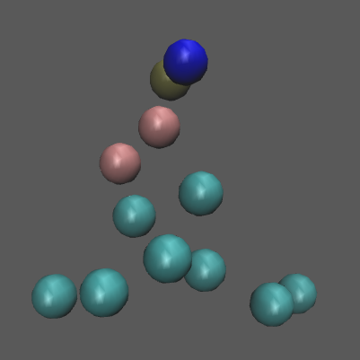
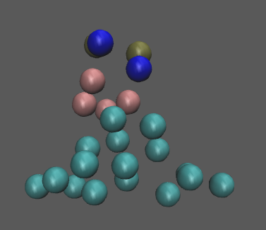
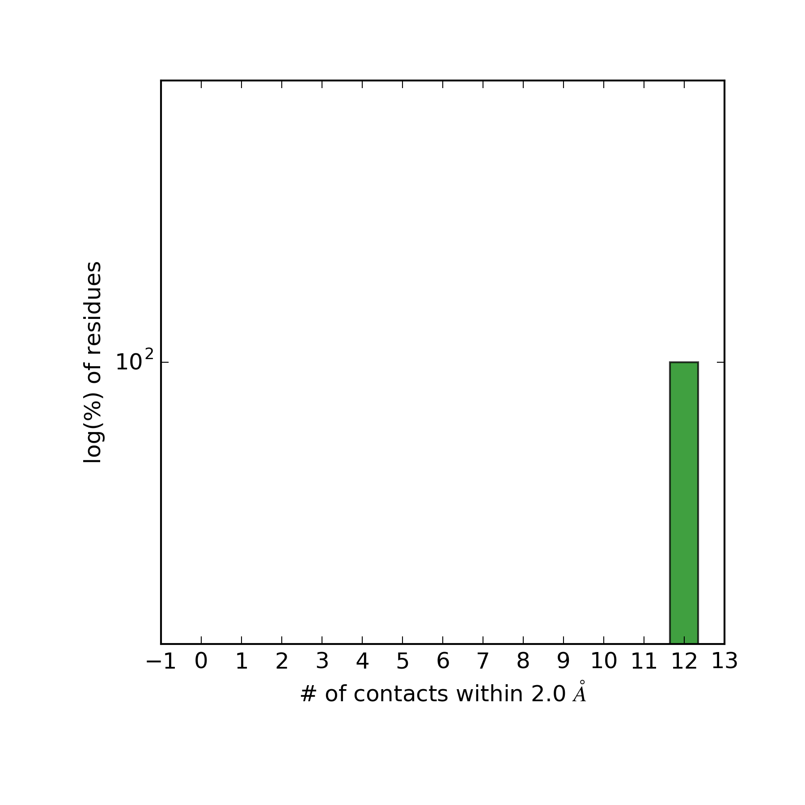
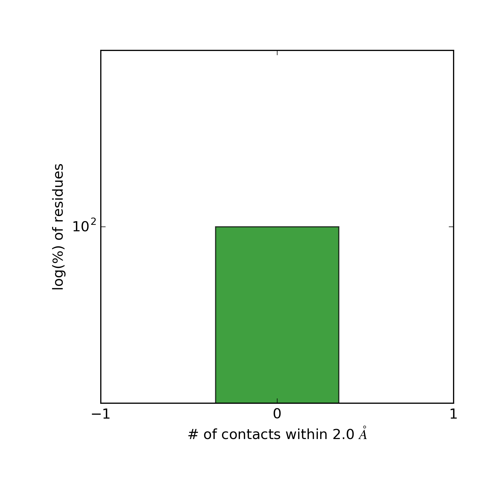

[](https://travis-ci.org/tylerjereddy/steric-conflict-resolution)
[](https://coveralls.io/github/tylerjereddy/steric-conflict-resolution?branch=master)

[](https://travis-ci.org/tylerjereddy/steric-conflict-resolution/builds)
# steric-conflict-resolution
Automate the Resolution of Steric Conflicts in Simulation Candidate Coordinate Files

Currently designed to work with the MARTINI CG forcefield Only (though pull requests for expanded functionality are welcome). Built on top of Alchembed, MDAnalysis, and GROMACS.

The code is contained within a docker image that may be obtained on a machine with docker installed using:
```
docker pull tylerreddy/steric-conflict-resolution
```

You may then set up your input folder at a new path, i.e.: `mkdir /path/to/working_dir/` and place your input coordinate file, topology file, and forcefield files (separate `.itp` required for EACH lipid / molecule type) at this path. For example, working with two superposed DPPC molecules (they start with identical coordinates) an example input directory might have the following contents:
```
martini_v2.0_DPPC_01.itp
martini_v2.1.itp
sys.top
dppc_simple_copies.gro
```
The initial coordinates (`dppc_simple_copies.gro`) clearly show the two DPPC molecules on top of each other (indistinguishable): 

  

The steric conflict resolution code could then be initiated using a command similar to the following in bash (redirecting the output to a log file just in case):
```
docker run -v /path/to/working_dir/:/steric_conflict_resolution_work tylerreddy/steric-conflict-resolution /bin/bash -c "python /steric_conflict_resolution/run_steric_resolution.py -input_coord_file_path /steric_conflict_resolution_work/dppc_simple_copies.gro -index_list 1 24 -residue_names_list DPPC -cutoff 2.0 -list_particles_per_residue 12 -output_path /steric_conflict_resolution_work -topology_filepath /steric_conflict_resolution_work/sys.top"  2>&1 | tee log.txt
```

This above command should mount the contents of `/path/to/working_dir/` into the docker image at the appropriate location, run the steric resolution code, and place the output files in the `results/` subfolder of the working directory on your machine.

As you can see, the two DPPC lipids in the output coordinates have separated from each other by at least 2.0 A:
 

Furthermore, after each iteration a summary plot of the steric conflict situation is automatically produced (though formatting could be improved):

##Round 1 -- Multiple steric conflicts for the two superposed residues

 

##Round 2 -- Steric conflicts have been completely resolved

 

Clearly, all steric conflicts within the specified cutoff have been resolved. The raw data is also made available (as Python pickle files) if you wish to produce custom plots, etc.

Although this particular example is fairly crude, the idea is that you may scale up to much larger systems that experience issues with steric conflicts that prevent a direct entry into conventional energy minimization procedures.
